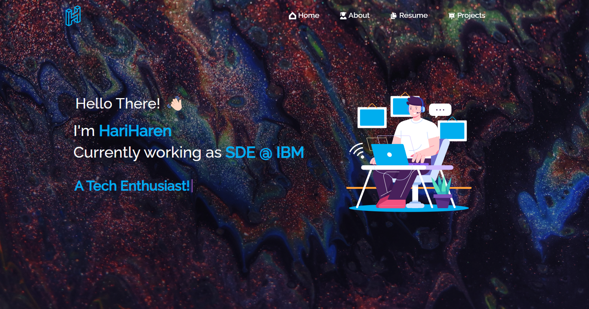

<h2 align="center">
  Portfolio Website 
  <a href="http://hariharen.netlify.app/" target="_blank">HARIHAREN | HH</a>
</h2>
<h6 align="center">Demo ☝</h6>

  
   
  
  

 

## Built With

My personal portfolio <a href="http://Hariharen.netlify.app/" target="_blank">Hariharen</a> which features some of my github projects as well as my resume and technical skills. 

This project was built using React.JS.

## Features

**📖 Multi-Page Layout with Particles effect**

**🎨 Styled with React, Css, Tachyon, React-Icons etc...**

**📱 Fully Responsive**

## 🛠 Installation and Setup Instructions

1. Installation: `npm install`.

2. In the project directory, you can run: `npm start`.

Runs the app in the development mode.\
Open [http://localhost:3000](http://localhost:3000) to view it in the browser.
The page will reload if you make edits.

### Show your support

Give a ⭐ if you like this website!
